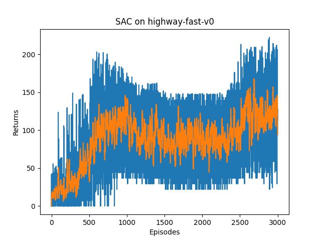

# Social Attention Experiment

An implementation of the paper [Social Attention for Autonomous Decision-Making in Dense Traffic](https://arxiv.org/pdf/1911.12250.pdf) with custom modification (experiments with SAC, GAIL and other potential advancements).

The first attempt uses the low-level continuous action, which might be harder for the agent to learn (RGB rendering shows that the agent goes crazy and few other vehicles appeared in the view), perhaps our next step is to try out SAC over discrete action space (with the DiscreteMetaAction type).

## To-do List

- [x] Try out [DiscreteMetaAction](http://highway-env.farama.org/actions/#discrete-meta-actions) (which clearly avoids the problem of the agent going crazy, and we put rgb_render on so that you can actually see how it performs.)

    * Issue 1: discrete SAC is not working (entropy gets done to 0 quickly and the agent only learns to act FASTER), the target_entropy setting in my code is suspicious according to [this paper](https://arxiv.org/pdf/2112.02852.pdf). We'll do double DQN for the discrete case for simplicity.
    * Issue 2: double DQN appears to be prone to catastrophic forgetting, the displayed result is one of the many attempts that does not turn to keep declining after a peak. The plan is to try out methods that explore & exploit more efficiently so that our Q network does not get to update the sub-optimal transitions only after a period of training, check out [prioritized experience replay](https://arxiv.org/pdf/1511.05952.pdf) or [Bayesian DQN](https://arxiv.org/pdf/1802.04412.pdf).
    * Issue 3: our agent dies quickly at times (see the huge variance in the returns), perhaps some [safety RL](https://cdn.openai.com/safexp-short.pdf) methods should be considered.

- [ ] Treat a trained agent as an expert (or maybe collect manual control data) and try out [GAIL](https://arxiv.org/pdf/1606.03476.pdf) and [CQL](https://arxiv.org/pdf/2006.04779.pdf).

- [ ] Incorporate DRQN to enhance performance (maybe refer to this paper [Playing FPS Games with Deep Reinforcement Learning](https://arxiv.org/pdf/1609.05521.pdf))

## Results

### Continuous Action (3000 episodes, reward scale x10)

### Meta-Discrete Action (3000 episodes, reward scale x10)

